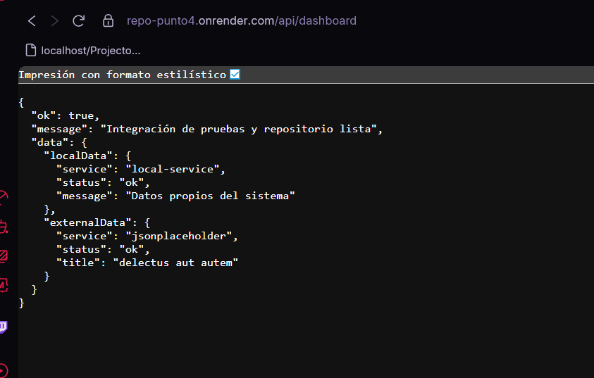
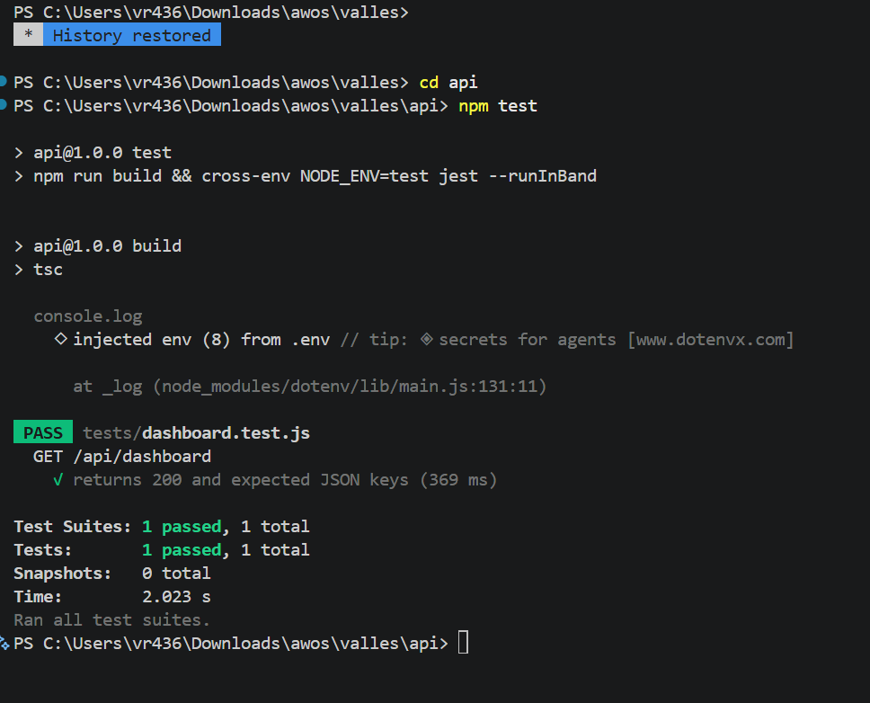

# API Mashup - Entrega de Actividad

Repositorio publico preparado para evaluacion de una API mashup con pruebas de integracion y documentacion de soporte.

## 1. Arquitectura Mashup
El endpoint GET /api/dashboard integra en una sola respuesta:
- datos locales simulados de la aplicacion,
- datos externos obtenidos desde JSONPlaceholder.

Flujo tecnico:
1. El cliente consume GET /api/dashboard.
2. El controlador construye localData.
3. El controlador consulta la API externa.
4. La API responde un JSON unificado con ambos resultados.

## 2. Seguridad y Entorno (.env)
Configuracion sensible gestionada con variables de entorno.

- No se suben secretos al repositorio.
- .env esta ignorado por git.
- .env.example funciona como plantilla publica.

Ejemplo minimo:

PORT=3000
EXTERNAL_API_URL=https://jsonplaceholder.typicode.com/todos/1

## 3. Despliegue en nube
Este proyecto puede desplegarse en Render, Railway o Vercel usando:

- Build/Install: npm install
- Start: npm start

Pasos sugeridos:
1. Conectar el repositorio publico en la plataforma PaaS.
2. Definir variables de entorno (PORT y EXTERNAL_API_URL).
3. Desplegar.
4. Probar los endpoints /health y /api/dashboard.

## 4. Repositorio y Pruebas

### Estructura recomendada
```text
repo-punto4/
├── src/
│   ├── controllers/
│   │   └── dashboardController.js
│   ├── routes/
│   │   └── dashboardRoutes.js
│   └── server.js
├── tests/
│   └── app.test.js
├── docs/
│   ├── img/
│   │   ├── endpoint-dashboard.png
│   │   └── test-output.png
│   ├── seguridad.md
│   ├── despliegue.md
│   └── pruebas.md
├── .env.example
├── .gitignore
├── package.json
└── README.md
```

### Comandos principales
- npm install
- npm start
- npm test

### Endpoints
- GET /
- GET /health
- GET /api/dashboard

### Evidencia
Ver la documentacion en docs/pruebas.md para el registro de pruebas y salida esperada.

### Capturas en README
Guarda tus capturas en docs/img con estos nombres:
- endpoint-dashboard.png
- test-output.png

Luego se veran aqui:




