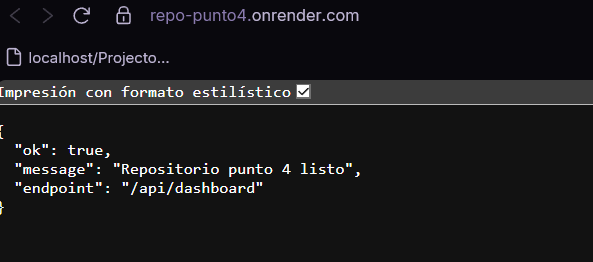
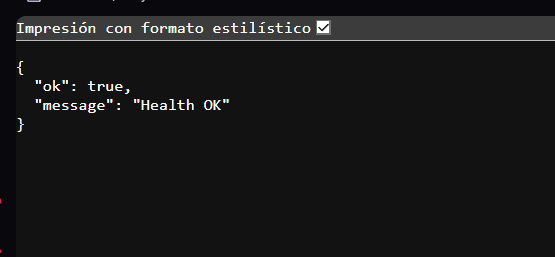

# API Mashup - Entrega de Actividad

Repositorio publico preparado para evaluacion de una API mashup con pruebas de integracion y documentacion de soporte.

## Estado de cumplimiento
- [x] 3. Proceso de Despliegue Nube
- [x] 4. Repositorio y Pruebas

## 1. Arquitectura Mashup
El endpoint GET /api/dashboard integra en una sola respuesta:
- datos locales simulados de la aplicacion,
- datos externos obtenidos desde JSONPlaceholder.

Flujo tecnico:
1. El cliente consume GET /api/dashboard.
2. El controlador construye localData.
3. El controlador consulta la API externa.
4. La API responde un JSON unificado con ambos resultados.

## 2. Seguridad y Entorno (.env)
Configuracion sensible gestionada con variables de entorno.

- No se suben secretos al repositorio.
- .env esta ignorado por git.
- .env.example funciona como plantilla publica.

Ejemplo minimo:

PORT=3000
EXTERNAL_API_URL=https://jsonplaceholder.typicode.com/todos/1

## 3. Proceso de Despliegue en la Nube
La aplicacion esta preparada para ejecutarse con el script de inicio definido en package.json, lo cual es requisito para cualquier plataforma PaaS.

### 3.1 Script de inicio requerido (package.json)

{
	"scripts": {
		"start": "node src/server.js",
		"dev": "nodemon src/server.js",
		"test": "jest"
	}
}

### 3.2 Pasos recomendados para despliegue

Paso 1 - Subir el repositorio a GitHub

git add .
git commit -m "feat: mashup api ready"
git push origin main

Paso 2 - Crear un servicio en Render, Vercel o AWS

- Conectar la cuenta de GitHub.
- Seleccionar el repositorio repo-punto4.

Opciones de plataforma:
- Render: Web Service.
- Vercel: Project con framework Other.
- AWS: App Runner conectado a GitHub.

Paso 3 - Configurar el comando de inicio

- Build Command: npm install
- Start Command: npm start

Paso 4 - Definir variables de entorno

- Agregar PORT y otras variables en el dashboard del PaaS.

Paso 5 - Verificar el endpoint

- Acceder a: https://tu-app.onrender.com/api/dashboard
- Verificar respuesta JSON con datos combinados.

Nota: En Render Free puede existir cold start por inactividad, por lo que la primera respuesta puede tardar mas tiempo.

## 4. Repositorio y Pruebas

### Estructura recomendada
```text
repo-punto4/
├── src/
│   ├── controllers/
│   │   └── dashboardController.js
│   ├── routes/
│   │   └── dashboardRoutes.js
│   └── server.js
├── tests/
│   └── app.test.js
├── docs/
│   ├── img/
│   │   ├── endpoint-home.png
│   │   ├── endpoint-health.png
│   │   ├── endpoint-dashboard.png
│   │   └── ostiachaval.png
│   ├── seguridad.md
│   ├── despliegue.md
│   └── pruebas.md
├── .env.example
├── .gitignore
├── package.json
└── README.md
```

### Comandos principales
- npm install
- npm start
- npm test

### Endpoints
- GET /
- GET /health
- GET /api/dashboard

### Evidencia
Ver la documentacion en docs/pruebas.md para el registro de pruebas y salida esperada.

Reporte recomendado de pruebas:
- Captura del endpoint /api/dashboard en ejecucion.
- Captura de salida de npm test.
- Log corto de despliegue exitoso en plataforma nube.

### Capturas en README
Guarda tus capturas en docs/img con estos nombres:
- endpoint-home.png
- endpoint-health.png
- endpoint-dashboard.png
- ostiachaval.png

Luego se veran aqui:






