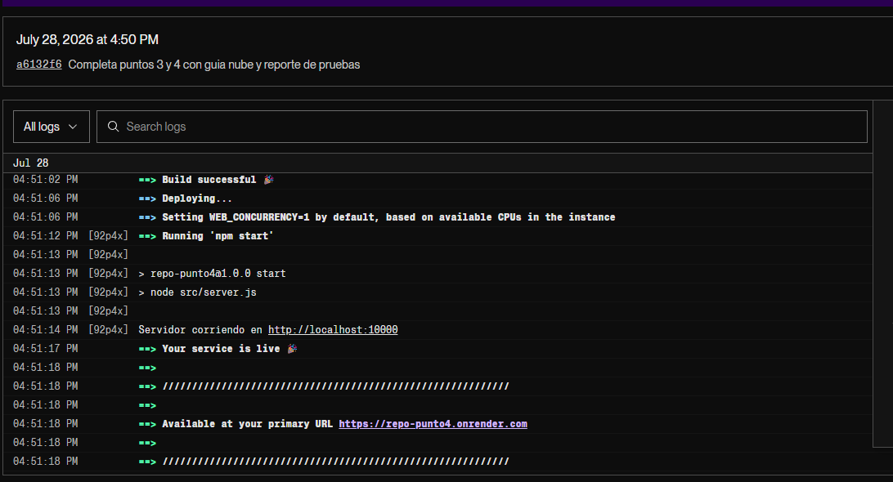

# Evidencia de Pruebas

## Objetivo
Validar que el endpoint mashup responde correctamente y que la prueba automatizada de integracion pasa.

## Prueba manual de consumo
Comando:

curl http://localhost:3000/api/dashboard

Resultado esperado:
- Codigo HTTP 200
- Campo ok en true
- Objeto data con localData y externalData

## Prueba automatizada
Comando:

npm test

Salida esperada (resumen):
- tests: 1
- pass: 1
- fail: 0

## Criterio de aceptacion
La entrega se considera valida cuando ambas pruebas (manual y automatizada) cumplen el resultado esperado.

## Evidencia visual y logs
- Captura 1: docs/img/endpoint-home.png
- Captura 2: docs/img/endpoint-health.png
- Captura 3: docs/img/endpoint-dashboard.png
- Captura 4: docs/img/test-output.png
- Captura 5: docs/img/ostiachaval.png
- Log sugerido: salida de despliegue exitoso en Render, Vercel o AWS.

## Nota de despliegue (Render Free)
En el plan gratuito de Render existe cold start por inactividad; la primera respuesta puede presentar latencia adicional (hasta ~50 segundos).

## Evidencia de despliegue en Render
Resumen del log observado en produccion:
- Build successful.
- Running "npm start".
- node src/server.js.
- Your service is live.
- Available at primary URL: https://repo-punto4.onrender.com.

Este log confirma que el servicio compilo, arranco correctamente y quedo publicado en la URL de Render.

Captura del log de despliegue:

